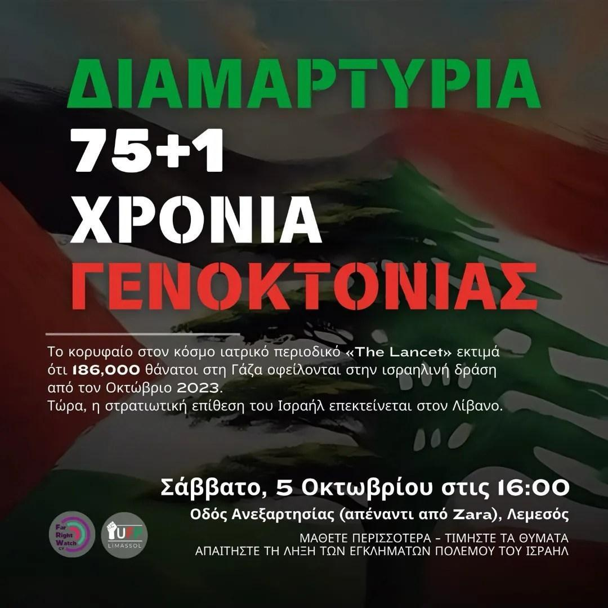

# [United for Palestine](./)

## Upcoming Event

🇵🇸 Ελάτε μαζί μας να τιμήσουμε τα θύματα των ισραηλινών εγκλημάτων πολέμου στην Παλαιστίνη και τον Λίβανο, καθώς κλείνει ένας χρόνος κατά τον οποίο η γενοκτονία που μεταδίδεται ζωντανά έχει ανοίξει τα μάτια της δυτικής κοινής γνώμης στις τρομακτικές επιπτώσεις του σιωνισμού και της αποικιοκρατίας.

🇱🇧 Καθώς το Ισραήλ, υποστηριζόμενο από τους δυτικούς του συμμάχους, επεκτείνει τον πόλεμό του, η κυπριακή κοινωνία εκτίθεται σε σοβαρό κίνδυνο χωρίς καμία προστασία από τα κυβερνώντα πολιτικά κόμματα.

🚨 Πρέπει να γίνουν δραστικές αλλαγές κατεύθυνσης για την αποκλιμάκωση της στρατιωτικής δράσης σε όλα τα μέτωπα, να τεθεί το Ισραήλ προ των ευθυνών του και να χαραχθεί ένας δρόμος προς την αποαποικιοποίηση, την ειρήνη και τη δικαιοσύνη.

📌 Συναντήστε μας στις 4μμ, 5 Οκτωβρίου, στην οδό Ανεξαρτησίας (απέναντι από το Zara) για να μάθετε περισσότερα για το ιστορικό πλαίσιο, τα τρέχοντα γεγονότα και να σταθείτε αλληλέγγυοι με την Παλαιστίνη & το Λίβανο.

## Help us with Greek translations

Are you a capable English speaker that also writes Greek?

Please send us a an email:
<a href="mailto:crept-hurt-recount@duck.com?subject=Help with UFP webpage greek translations">crept-hurt-recount@duck.com</a>

## Education

- [Know Your Rights (pdf)](/asset/Leaflet_know your rights_GR.pdf)
