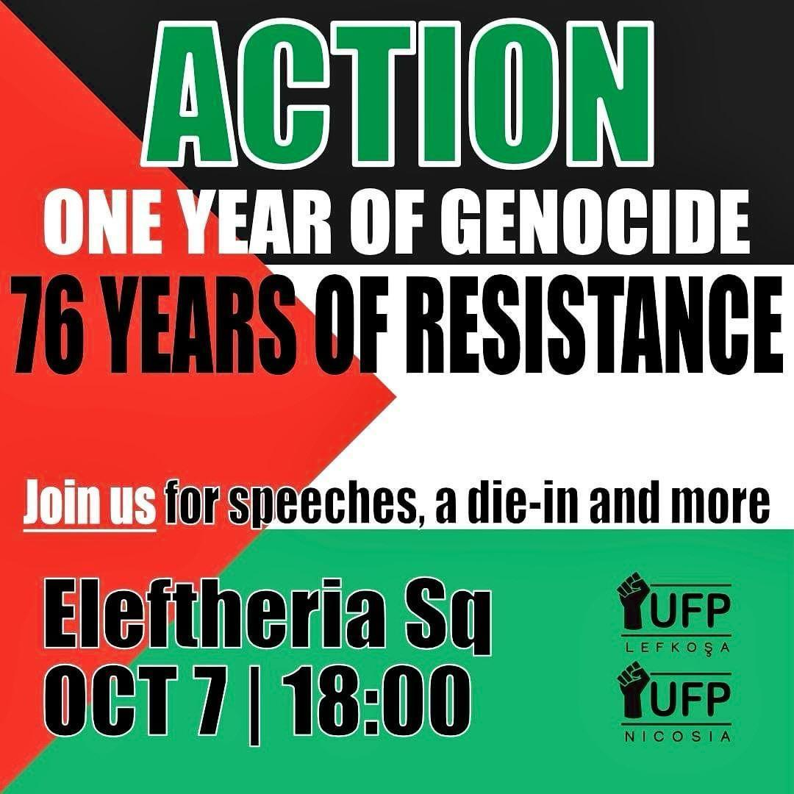

# One Year of Genocide, 76 Years of Resistance

The Nakba never ended.

Join us this Monday on Oct 7th to demonstrate against 75+1 year of Genocide in Palestine.

Let us use our voice on this yearly mark to express our dismay against Apartheid, Settler Colonialism and Brutal military occupation imposed on the Palestinian people.

Use your voice! Be plenty! Be loud! Bring your instrument.

- 📍 Eleftheria Square, Nicosia.
- ⏰ 18:00
